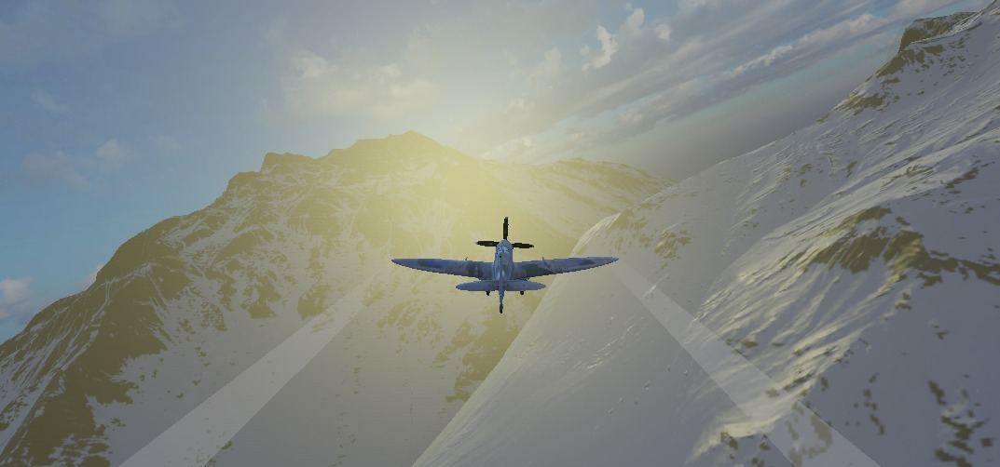
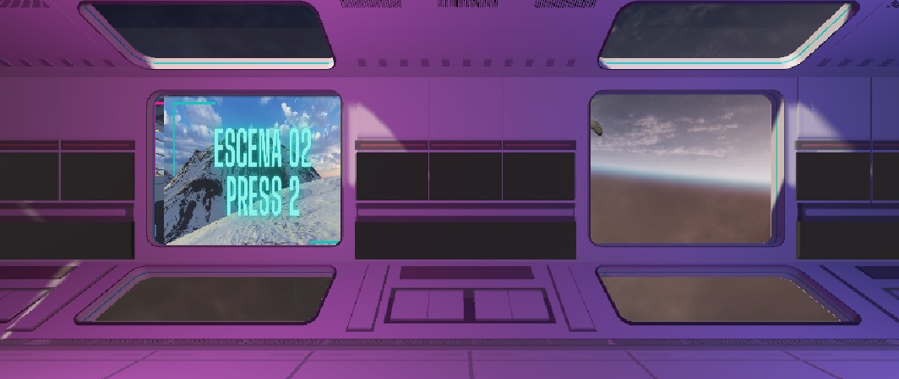

# Flight Simulator using Haptic chair and Virtual Reality
This is the software developed using the **Unity 2022.3 LTS** to create a virtual reality environment to simulate flight training.

## Main menu
In the main menu, there are 2 options to select by users.

## Results of TR_KF Interface
Results of whole set of features tracked are presented in 2 graphics which are related with the mean distance and mean velocity computed during the sequence of images.
Error is the measure of the Kalman filter for the detection process.

TR_KF Interface has been presented in paper https://www.sciencedirect.com/science/article/abs/pii/S0026265X24009822
