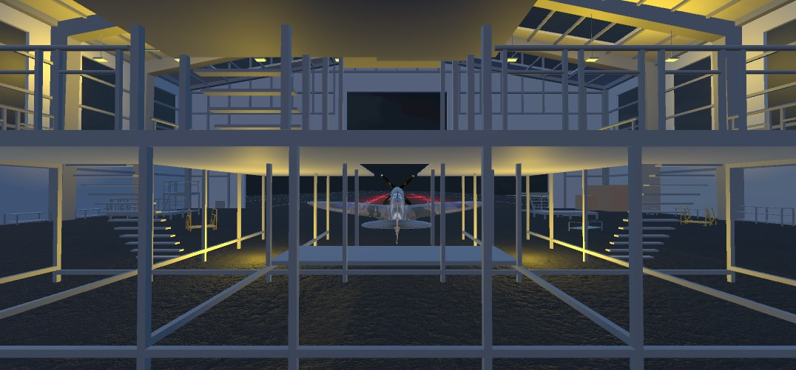
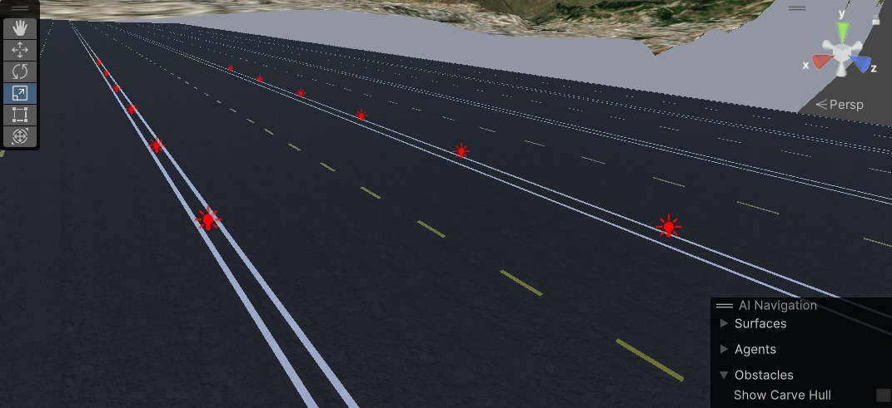
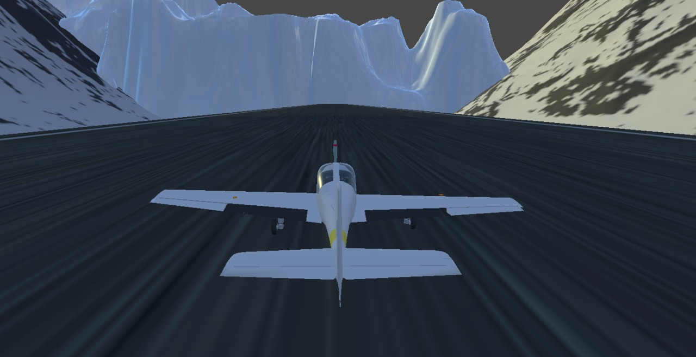

# Flight Simulator using Haptic chair and Virtual Reality
This is the software developed using the **Unity 2022.3 LTS** to create a virtual reality environment to simulate flight training.

## Main menu
In the main menu, there are 2 options to select by users.
- Scene 1: Environment based on the local geography of Riobamba.
- Scene 2: Environment based on the Top Gun movie.
  

## Design plane in Unity

|    |  |
| -------- | ------- |

## Hangar and runway design

|    |  |
| -------- | ------- |

